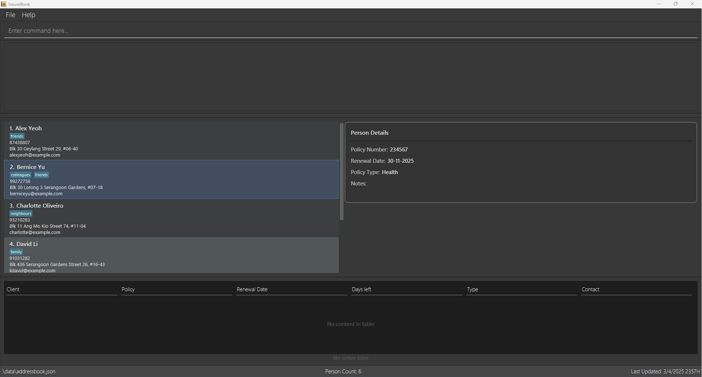

# InsureBook

## Overview
InsureBook is a desktop CLI-based contact management application specifically designed for insurance agents. It helps professionals manage their clientele efficiently by providing robust tools for tracking, organizing, and following up with clients.

## Key Features
- **Client Management**:
    - Create, edit, and delete client profiles
    - Add detailed client information including contact details and policy numbers
    - Tag and categorize clients for easy organization

- **Search and Filter**:
    - Quickly find clients using various search criteria
    - Filter clients by tags, renewal dates, and other attributes
    - Sort client lists for better insights

- **Renewal Tracking**:
    - View upcoming policy renewals
    - Set reminders for important client follow-ups
    - Proactively manage client relationships

## Target Users
Insurance agents who:
- Need to manage a large client base
- Want to streamline administrative tasks
- Seek to improve client relationship management
- Are moderately tech-savvy

## Tech Highlights
- Desktop application with Command Line Interface (CLI)
- Data persistence with automatic saving
- Designed for efficiency and ease of use

* If you are interested in using InsureBook, head over to the [_Quick Start_ section of the **User Guide**](UserGuide.html#quick-start).
* If you are interested about developing InsureBook, the [**Developer Guide**](DeveloperGuide.html) is a good place to start.

**Acknowledgements**

This project is based on the AddressBook-Level3 project created by the [SE-EDU initiative](https://se-education.org).
